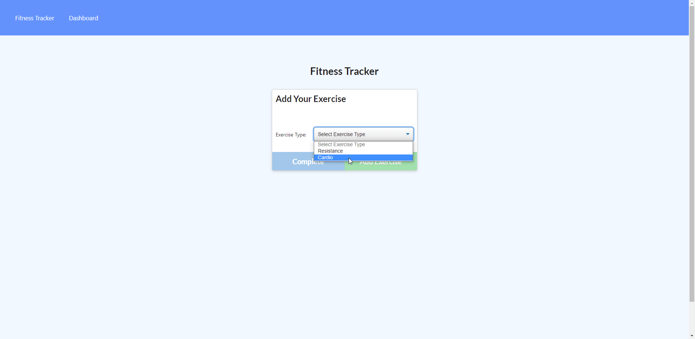

<h1 style="text-align: center;">Fitness Tracker</h1>

[[Deployed Site]](https://fitness-tracker18278.herokuapp.com/stats)

[[Preview]](#Preview)

## General overview: 

 
For this project my goal was to create a fitness tracker Application that will allow the user to add workouts to a database save it and view it using mongoDB, express, & JavaScript. I built the server.js, models, route files from a collection of notes and general knowledge to successfully setup express and link the backend to the front end. The user will now be able to use the site to add in workouts and view data with a click of a button.

<h3 style="text-align:center;">Instructions</h3>

1. Click New workout to add a new workout
2. select exercise type in drop down menu
3. fill out inputs with data you would like to have on record and charted
4. Click complete to finish or add exercise to add and view
5. Click dashboard to see a collection of all data represented in graphs
6. Enjoy!

<h3 style="text-align:center;">Changes-Summary</h3>

* Added Packages needed for the application
* Added server.js
* Added modules
* Created better structure for files
* Added setup for express app
* Added mongo
* Added setup pathing for each file
* Added setup api routes
* Added setup models
* Fixed typos

>Notes: Unfortunately couldn't figure out how to get the range of duration to function...

## Preview

